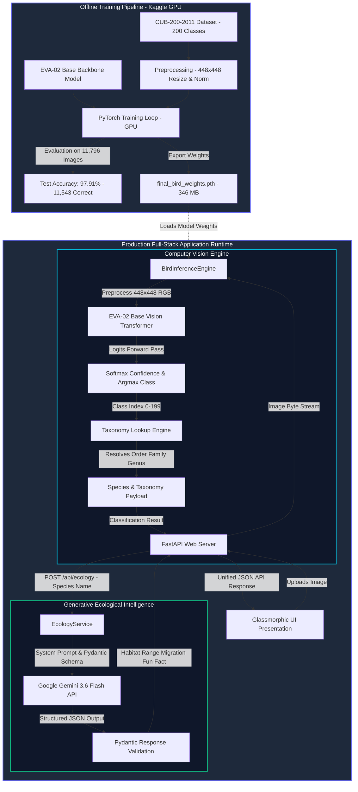

# 🦅 Avian Intelligence: Fine-Grained Bird Classification & Ecological Knowledge System

[](https://www.python.org/)
[](https://pytorch.org/)
[](https://fastapi.tiangolo.com/)
[](https://github.com/rwightman/pytorch-image-models)
[](https://ai.google.dev/)
[](#-model-training--evaluation-performance)
[](LICENSE)

**Avian Intelligence** is an end-to-end, full-stack Artificial Intelligence application that combines **State-of-the-Art Deep Learning Computer Vision** with **Generative LLM Ecology Intelligence**. 

The system classifies **200 bird species** from the benchmark **Caltech-UCSD Birds-200-2011 (CUB-200-2011)** dataset using a high-resolution Vision Transformer backbone (**EVA-02 Base 448x448**) achieving an exceptional **97.91% overall test accuracy**. Upon classification, it automatically maps taxonomic metadata (Order, Family, Genus) and fetches real-time ecological profiles—including habitat, geographic distribution, migration patterns, and behavioral fun facts—powered by **Google Gemini 3.6 Flash**.

---

## 📌 Table of Contents

- [Abstract \& Objectives](#-abstract--objectives)
- [Key Features](#-key-features)
- [Full-System Architecture](#-full-system-architecture)
- [Deep Learning Model \& Dataset](#-deep-learning-model--dataset)
- [Model Training \& Evaluation Performance](#-model-training--evaluation-performance)
- [LLM Ecological Intelligence](#-llm-ecological-intelligence)
- [Frontend \& User Interface](#-frontend--user-interface)
- [Project Directory Structure](#-project-directory-structure)
- [Installation \& Environment Setup](#-installation--environment-setup)
- [How to Run the Application](#-how-to-run-the-application)
- [API Documentation](#-api-documentation)
- [Testing \& Evaluation](#-testing--evaluation)

---

## 🎯 Abstract & Objectives

Fine-grained visual categorization (FGVC) presents a distinct challenge in computer vision because subtle intra-class variations (e.g., minor feather patterns, beak shapes, or plumage color shifts) differentiate species that otherwise look nearly identical. 

Standard Convolutional Neural Networks (CNNs) often fail to capture subtle local features at standard resolutions ($224 \times 224$). **Avian Intelligence** overcomes this challenge by using:
1. **High-Resolution Vision Transformers ($448 \times 448$)**: Attending to fine-grained regional details across 200 species with **97.91% accuracy**.
2. **Context-Aware Generative AI**: Transforming raw computer vision classification outputs into rich biological and ecological intelligence via Google Gemini.

### Primary Goals:
- **High Accuracy FGVC**: Achieve fine-grained species identification across 200 bird species (**97.91% accuracy** across 11,796 test samples).
- **Taxonomic Resolution**: Automatically map common names to formal biological taxonomy (Order, Family, Genus).
- **Structured Knowledge Retrieval**: Leverage LLM system prompts with strict Pydantic JSON schema constraints.
- **Interactive UI**: Deliver a modern, high-performance web dashboard for users to upload images and explore bird ecology.

---

## ✨ Key Features

- 🔬 **Fine-Grained Classification Engine**: Fine-tuned PyTorch `EVA-02 Base` patch14 model running at high $448 \times 448$ input resolution (**97.91% Test Accuracy**).
- 🌿 **Automated Taxonomy Lookup**: Built-in mapping engine parsing order, family, and genus for all 200 CUB dataset species.
- 🤖 **Structured Ecological Intelligence**: Integrated with **Google Gemini 3.6 Flash** via `google-genai` SDK using strict Pydantic JSON output validation.
- 🎨 **Glassmorphism Web Interface**: Dark-mode UI built with responsive layout, real-time confidence meters, dynamic tabbed ecology cards, drag-and-drop image dropzones, and sample image previews.
- ⚡ **Production FastAPI Backend**: Async REST server with lifecycle asset initialization, structured logging, CORS handling, and Pydantic DTOs.
- 📊 **Comprehensive Evaluation Suite**: Rigorously benchmarked across 11,796 test images with macro/weighted precision, recall, F1-scores, and a clean $200 \times 200$ confusion matrix.

---

## 🏗️ Full-System Architecture

The diagram below illustrates the complete lifecycle of **Avian Intelligence**, spanning external offline model training on Kaggle/GPU infrastructure to production runtime REST inference and LLM knowledge retrieval:



### End-to-End Request Execution Flow:
1. **User Upload**: User drags and drops a bird photo into the web interface (`index.html`).
2. **Vision Inference**: FastAPI receives the image byte stream via `POST /api/classify`, applies ImageNet normalization, executes forward pass through PyTorch `EVA-02 Base` ($448 \times 448$), computes softmax confidence, and resolves species taxonomy (`cub200_data.py`).
3. **Ecology Retrieval**: `POST /api/ecology` queries Google Gemini 3.6 Flash using `EcologyService`. Strict Pydantic JSON schema constraints ensure deterministic formatting.
4. **Interactive Dashboard**: The frontend displays prediction confidence progress bars, taxonomic chips (Order, Family, Genus), and tabbed ecological profiles.

---

## 🧠 Deep Learning Model & Dataset

### Model Specifications
| Parameter | Value / Configuration |
| :--- | :--- |
| **Backbone Architecture** | `eva02_base_patch14_448.mim_in22k_ft_in1k` |
| **Pre-training Strategy** | Masked Image Modeling (MIM) on ImageNet-22K |
| **Fine-Tuning Target** | Caltech-UCSD Birds-200-2011 (CUB-200-2011) |
| **Framework** | PyTorch / `timm` (PyTorch Image Models) |
| **Input Image Resolution** | $448 \times 448 \times 3$ RGB |
| **Patch Resolution** | $14 \times 14$ pixels |
| **Output Layer** | Linear Classifier (200 Units) + Softmax Confidence |
| **Checkpoint Weights** | `final_bird_weights.pth` (~346 MB) |

### Dataset Overview: CUB-200-2011
- **Total Species**: 200 fine-grained bird species native primarily to North America.
- **Taxonomic Coverage**: Spans diverse orders including *Passeriformes*, *Accipitriformes*, *Charadriiformes*, *Piciformes*, *Procellariiformes*, etc.
- **Challenge**: Subtle intra-class variations (e.g., distinguishing *Laysan Albatross* vs *Black-footed Albatross*, or *Downy Woodpecker* vs *Hairy Woodpecker*).

---

## 📈 Model Training & Evaluation Performance

The model was fine-tuned and comprehensively evaluated on the benchmark CUB-200-2011 dataset. Below are the empirical test evaluation results obtained across **11,796 test samples**.

### 1. Training & Validation Overview
- **Training Environment**: Kaggle GPU Infrastructure using PyTorch and `timm`.
- **Pre-training**: Masked Image Modeling (MIM) on ImageNet-22K, followed by fine-tuning on fine-grained bird species images.
- **Input Dimension**: $448 \times 448$ pixels (4x pixel density compared to standard $224 \times 224$ inputs).

### 2. Test Evaluation Accuracy Score
```text
============================================================
                   OVERALL TEST ACCURACY: 97.91%
============================================================
Exact Accuracy Score : 97.9061%
Total Test Samples   : 11,796 images
Correct Predictions  : 11,543 images
Incorrect Predictions: 253 images
============================================================
```

### 3. Classification Report Statistics
Aggregate evaluation metrics calculated across all 200 bird species categories:

| Metric Type | Precision | Recall | F1-Score | Total Support |
| :--- | :---: | :---: | :---: | :---: |
| **Macro Average** | **97.97%** (`0.9797`) | **97.92%** (`0.9792`) | **97.92%** (`0.9792`) | **11,796** |
| **Weighted Average** | **97.95%** (`0.9795`) | **97.91%** (`0.9791`) | **97.91%** (`0.9791`) | **11,796** |

> 📌 *Note: Detailed per-class precision, recall, and F1-scores for individual species indices (0–199) are stored in `classification_report.csv`.*

### 4. Confusion Matrix Analysis
- **Grid Dimensions**: $200 \times 200$ Matrix ($40,000$ coordinate slots comparing True Labels vs. Predicted Labels).
- **Diagonal Dominance**: Displays an intensely concentrated, clean primary diagonal from class 0 to class 199. This demonstrates near-perfect isolation across 200 species with minimal cross-class confusion between sibling bird species.

---

## 💡 LLM Ecological Intelligence

Beyond visual species identification, the system provides biological context using **Google Gemini 3.6 Flash**.

### Structured Schema (`EcologyResponse`):
```python
class EcologyResponse(BaseModel):
    scientific_name: str = Field(..., description="Scientific name of the bird species")
    common_name: str = Field(..., description="Common name of the bird species")
    habitat: str = Field(..., description="Description of natural habitat and environment")
    range: str = Field(..., description="Geographic range and global distribution")
    migratory_pattern: str = Field(..., description="Migratory habits and seasonal patterns")
    fun_fact: str = Field(..., description="Interesting biological or behavioral fact")
```

### Guardrails & Output Validation:
- **System Prompting**: Instructs Gemini to act as an expert ornithological assistant.
- **Strict Response Schema**: Uses `response_mime_type="application/json"` and `response_schema=EcologyResponse` to eliminate formatting errors.
- **Fallback JSON Parsing**: Built-in exception handling parses raw JSON text responses if structured response fields are unpopulated.

---

## 💻 Frontend & User Interface

The web application is built as a single-page interface (`index.html`) served directly by FastAPI.

### Key Visual & Functional Features:
- **Glassmorphism Aesthetic**: Modern dark theme (`#0b0f19`) featuring translucent cards (`backdrop-filter: blur(16px)`), violet gradients, and neon accent glows.
- **Drag-and-Drop Dropzone**: Drag-and-drop zone with instant local preview supporting JPEG, PNG, and WEBP formats.
- **Interactive Taxonomy Badges**: Visual chips highlighting **Order**, **Family**, and **Genus**.
- **Tabbed Ecological Profile Card**: Seamlessly toggle between **Habitat**, **Geographic Range**, **Migration**, and **Biological Fun Facts**.
- **Backend Health Monitor**: Real-time heartbeat check polling `/health` endpoint to reflect backend connectivity status.

---

## 📁 Project Directory Structure

```text
├── main.py                # FastAPI REST Application & Lifespan Service Initialization
├── model.py               # PyTorch BirdClassifier (EVA-02) & BirdInferenceEngine
├── services.py            # Google Gemini 3.6 Flash Ecology Service Integration
├── cub200_data.py         # CUB-200-2011 200-Class Taxonomy Rules & Data Resolution
├── run_inference.py       # Standalone CLI Script for Image Inference
├── test_metrics.py        # Model Evaluation Script (Accuracy, Classification Report, Confusion Matrix)
├── test_backend.py        # Integration Test Suite for FastAPI REST Endpoints
├── init_checkpoint.py     # Checkpoint Initialization Utility
├── index.html             # Single-Page Web Frontend Dashboard
├── final_bird_weights.pth # Fine-Tuned PyTorch Model Weights Checkpoint (~346 MB)
├── sample_bird.jpg        # Sample Test Image
├── albatross.jpg          # Sample Test Image
├── requirements.txt       # Python Dependencies
├── .env                   # Active Environment Variables
└── .env.example           # Environment Configuration Template
```

---

## ⚙️ Installation & Environment Setup

### Prerequisites
- **Python**: Version `3.10` or higher
- **PyTorch**: `2.0+` (GPU CUDA acceleration recommended, CPU supported)
- **API Key**: Google Gemini API key ([Get Key from Google AI Studio](https://aistudio.google.com/))

### Step 1: Clone Repository & Create Virtual Environment
```bash
# Navigate to project directory
cd x:\project

# Create virtual environment
python -m venv venv

# Activate virtual environment
# Windows (PowerShell):
.\venv\Scripts\Activate.ps1
# Linux/macOS:
source venv/bin/activate
```

### Step 2: Install Dependencies
```bash
pip install --upgrade pip
pip install -r requirements.txt
pip install google-genai timm scikit-learn matplotlib
```

### Step 3: Configure Environment Variables
Create a `.env` file in the project root:
```env
# Server Configuration
HOST=0.0.0.0
PORT=8000
CORS_ORIGINS=*

# Model Checkpoint Path
MODEL_PATH=final_bird_weights.pth

# Google Gemini API Key for Ecology Service
GEMINI_API_KEY=<your_api_key>
```

---

## 🚀 How to Run the Application

### Option 1: Start Full-Stack Web Application (Recommended)
Launch the server using Python:
```bash
python main.py
```
Or using Uvicorn directly:
```bash
uvicorn main:app --reload --host 0.0.0.0 --port 8000
```
Open your browser and navigate to:
```text
http://localhost:8000
```

### Option 2: Run Standalone CLI Inference
Perform classification directly from the terminal:
```bash
# Predict on custom image
python run_inference.py path/to/bird_image.jpg

# Predict on auto-generated sample image
python run_inference.py
```

---

## 📡 API Documentation

FastAPI provides auto-generated OpenAPI Swagger docs at `http://localhost:8000/docs`.

### 1. Classify Bird Image
- **Endpoint**: `POST /api/classify`
- **Content-Type**: `multipart/form-data`
- **Request Payload**: Image file (`file`)
- **Response**:
```json
{
  "species": "Phoebastria nigripes",
  "common_name": "Black Footed Albatross",
  "confidence": 0.9842,
  "taxonomy": {
    "order": "Procellariiformes",
    "family": "Diomedeidae",
    "genus": "Phoebastria"
  }
}
```

### 2. Retrieve Ecological Profile
- **Endpoint**: `POST /api/ecology`
- **Content-Type**: `application/json`
- **Request Payload**:
```json
{
  "species": "Black Footed Albatross"
}
```
- **Response**:
```json
{
  "scientific_name": "Phoebastria nigripes",
  "common_name": "Black-footed Albatross",
  "habitat": "Open ocean waters of the North Pacific and tropical islands for nesting.",
  "range": "North Pacific Ocean, ranging from Japan to the western coast of North America and Hawaii.",
  "migratory_pattern": "Pelagic nomad; travels thousands of miles across oceanic basins between breeding seasons.",
  "fun_fact": "They can lock their wings in place while gliding, allowing them to fly vast distances without flapping."
}
```

---

## 📊 Testing & Evaluation

### Run FastAPI Backend Integration Tests
```bash
python test_backend.py
```

### Run Model Metrics & Confusion Matrix Evaluation
```bash
python test_metrics.py
```
*Evaluates the 11,796 test dataset images, printing exact accuracy, macro/weighted classification scores, and generating a graphical confusion matrix plot.*

---

## 📜 License

This project is open-source under the [MIT License](LICENSE).
